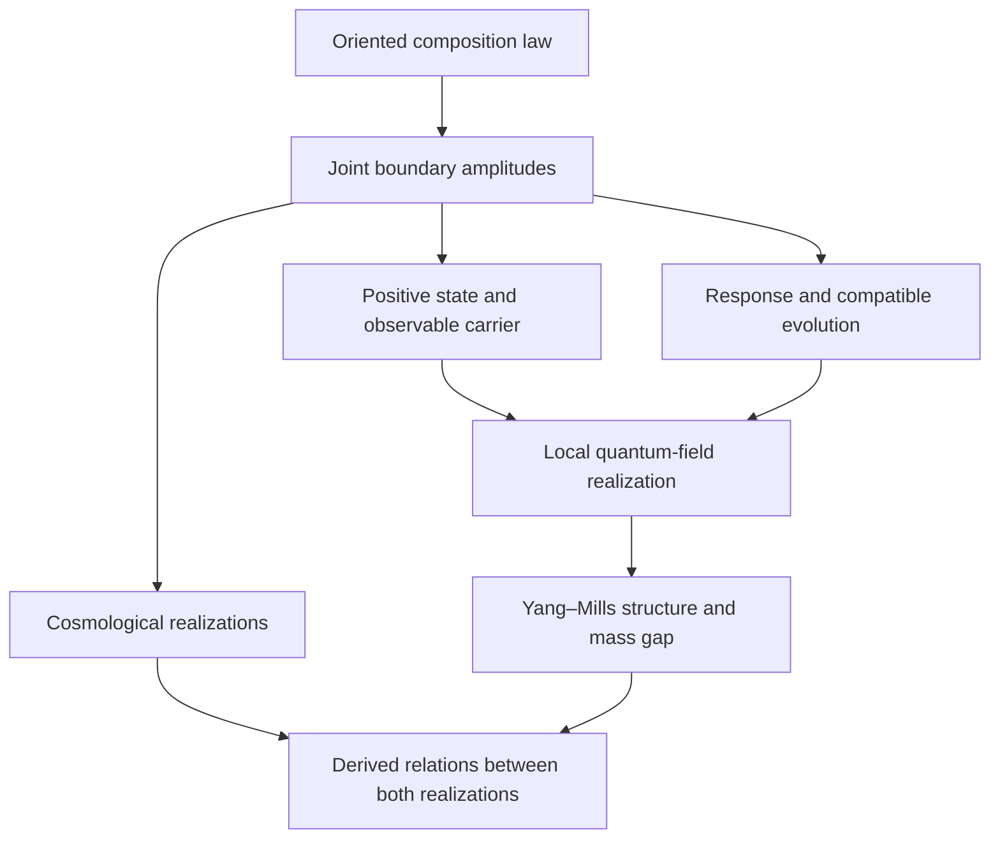

**I would make the central problem “joint realization”: find one oriented law of composition that makes the observable arena, its state, its symmetries, and its dynamics arise together.** The mass gap would then be a rigidity consequence of that law.

## prelude: copernican clue

What does the concept of "action" presuppose?  What does the concept of an "observable" presuppose?  Distinguishability.  The deeper difference between "identity and difference" itself.  The difference between "asymmetry" and "symmetry".  What deeper mathematical object presents a duality between these two faces?  And does the modular geometry of "information" or "distinction" sit beneath?  Is "time" best modeled as some kind of "modular flow" that is beneath the "arrow of entropy", since it makes "entropy" possible as a concept?

Physics is the study of descriptions that are invariant over redefinitions.
Physics is ultimately mathematics.
Maybe the next big paradigm shift is a description of natural invariant laws that encompass both a "localized" and "globalized" redefinition of terms?

How can we "think backwards"?  What if we start with a mathematical object that has a "mass gap" (properly defined), and then show how it produces exactly the conditions for the Yang Mills problem with properties that are analogous to traditional QFT?  What if we start with "asymmetry" as fundamental, and show how "symmetry groups emerge" under some necessary function?

## starting place

The `sech²` observation belongs inside this larger programme as a possible exact reduction and diagnostic. The deeper target is the law that produces the profile, decides what it operates on, and prevents arbitrarily soft physical distinctions.

I reviewed the Yang–Mills module, its foundational restart and research checkpoint, and the linked constructions. My review remained read-only.

Your reading of Jaffe–Witten has direct textual support. They discuss a new mathematical framework and explicitly suggest that the gap’s demonstration “may require a nonclassical change of variables” or duality. Their requirements fix the theory that must emerge; they leave substantial freedom in its construction. The stronger ontological reversal is ours to formulate and test. [Official problem description](https://www.claymath.org/wp-content/uploads/2022/06/yangmills.pdf)

**The research history identifies where the reversal must become mathematically consequential.**

The [foundational restart](C:/Users/sketc/Documents/physics/general-causal-action/directed-realization-and-foundational-restart.md) makes a revealing distinction. Much of the work successfully developed estimates **after supplying a field theory**, while the foundational question was supposed to be what jointly supplies that theory’s state, observable structure, and dynamics.

The latest calculations sharpen that diagnosis:

- **Exact local states leave joint structure undetermined.** Independently prepared blocks can each have their exact interacting vacuum while their crossing holonomy remains Haar-distributed. Other joint laws preserve those regional marginals while changing the crossing correlation. The relation between the regions contains mathematical information absent from either regional description. [Crossing-response theorem](C:/Users/sketc/Documents/physics/coarse-response-memory/product-boundary-frames-and-crossing-susceptibility.md)
- **A state and an instantaneous response do not determine the full dynamics.** Eliminating hidden variables can preserve a local form while concealing slow return processes. The missing object is the complete response through time or spectral parameter. [Coarse response memory](C:/Users/sketc/Documents/physics/coarse-response-memory/inq.md)
- **One geometric construction can determine several outputs, yet the allowed geometry can still encode arbitrary dynamics.** The projection-cycle examples demonstrate both possibilities. The foundational gain must therefore include a restriction on admissible constructions. [Research schema’s two selection tests (line 169)](C:/Users/sketc/Documents/physics/general-causal-action/research-schema.md:169)

These are constructive findings. They identify **relations between contexts, including their complete joint response**, as the strongest place to put the new mathematical primitive.

I would develop the programme through six connected tasks.

**1. Construct a law of composition whose evaluations determine the joint state.**

Start with presentations and directed processes between them. A presentation is initially a way of accessing distinctions; it need not be a spatial region or a collection of particles.

The proposed central object is a constrained family of **boundary amplitudes or preparation overlaps**. Schematically, for compatible preparations \(p,q\),

\[ \mathcal K(p,q)=\mathcal Z(p^\dagger\circ q). \]

Here:

- \(\circ\) is composition;
- \(\dagger\) is a formal reflected or dual boundary operation;
- \(\mathcal Z\) evaluates the resulting composition.

The dual operation need not be a physically executable reversal. This allows directed ontology and a positive quantum representation to coexist.

Seek positivity:

\[ \sum_{i,j}\overline{c_i}c_j\mathcal K(p_i,p_j)\ge0. \]

Quotienting null preparations and completing then constructs a Hilbert space. The workspace already has an exact [preparation-overlap construction](C:/Users/sketc/Documents/physics/directed-analytic-realization/preparation-overlaps-and-the-transition-algebra.md) in which the same overlaps determine an actual noncommutative transition algebra.

The additional constitutive principle must constrain \(\mathcal Z\). An arbitrary positive kernel can hide an arbitrary Hamiltonian. A concrete candidate would generate the amplitudes from a fixed multiplication law, its pairing, and admissible oriented comparison words, retaining all boundary indices and branch labels.

The intended explanatory order is:

````

````

This is a proposed construction programme. It is not a theorem that a bare category automatically supplies its evaluations.

The first success criterion is already substantial: **one independently specified composition rule must force a joint correlation and its dynamical response that previously required separate choices.**

**2. Derive symmetry as what preserves the oriented law.**

Your asymmetry-first proposal has exact examples in the workspace.

For the order-three operation \(w\),

\[ P=\frac{1+w+w^2}{3}, \qquad I_w=\frac{w-w^2}{\sqrt3}, \qquad I_w^2=-(1-P). \]

Replacing \(w\) by \(w^{-1}\) preserves \(P\) and reverses \(I_w\). The retained algebra can therefore forget orientation while the parent construction remembers it. [Order-three orientation and its stabilizer (line 55)](C:/Users/sketc/Documents/physics/exceptional-gauge-realization/order-three-orientation-and-the-exceptional-stabilizer.md:55)

There is also a more directly dynamical example. Two loop paths sharing a reference possess mixed covariance that neither marginal contains. Compatibility with that joint covariance forces their right boundary actions to agree within the specified transformation family. **The shared relation selects the admissible symmetry.** [Joint path-law theorem](C:/Users/sketc/Documents/physics/gauge-source-action-transport/joint-path-law-and-the-shared-boundary-action.md)

The general theorem to seek has the form

\[ \text{oriented primitive} \longrightarrow \text{admissible comparison transformations} \longrightarrow \text{inherited local symmetry}. \]

The inherited group is an image of a stabilizer; proving that it is the _entire_ local symmetry requires controlling both the kernel of realization and possible extra automorphisms.

For Clay, this needs a construction covering **every compact simple gauge group**. Exceptional algebra may eventually explain a particular physically selected group, but that further ambition should not obstruct recognizing a successful gauge-parametrized construction.

**3. Make global–local invariance a law of composition with retained response and memory.**

Here I would sharpen the Einstein analogy. Whole and local presentations can genuinely contain different accessible information. Their relation need not be invertible.

The invariant should therefore be the **law governing the passage**, with every contribution transported into a common comparison space.

The existing moving-response construction gives precisely such an identity. For an arrow \(p:X\to Y\), let \(T_p\) transport distinctions and let \(G_X,G_Y\) measure their response. When contractivity has been established,

\[ D_p=G_X-T_p^*G_YT_p\ge0. \]

For successive arrows,

\[ \boxed{D_{q\circ p}=D_p+T_p^*D_qT_p.} \]

The accumulated response deficit agrees whether the passage is evaluated directly or in stages. [Moving response balance](C:/Users/sketc/Documents/physics/algebra/moving-response-balance-and-a-ruble-operator-signature.md)

Its differential version includes the changing measuring structure:

\[ \dot G+B^*G+GB+R=0. \]

That is a particularly good mathematical expression of your reversal: what appears to change and the structure by which change is measured belong in one equation.

For dynamics, however, we must retain more than this instantaneous balance. In the workspace’s block setting,

\[ L= \begin{pmatrix} A&B^*\\ B&C \end{pmatrix}, \]

eliminating the hidden component yields

\[ \boxed{ \widehat R(z)= \left[z+A-B^*(z+C)^{-1}B\right]^{-1}. } \]

The term \(B^*(z+C)^{-1}B\) carries hidden return. Replacing it by its static value can erase the spectral information relevant to the gap.

**My proposed strengthening of General Causal Action is therefore to require closure under composition of complete boundary amplitudes and dynamical responses.** A local action would be one representation or controlled approximation of that richer object.

This has an existing foothold: [full boundary amplitudes close under sewing](C:/Users/sketc/Documents/physics/holonomy-state-refinement/overlap-kernels-and-face-refinement.md), whereas a single scalar face-weight family generally does not survive four-dimensional elimination.

**4. Seek a first-order operator of relational discrepancy.**

The productive lesson from Dirac is to search for an operator whose algebraic relations explain structures that previously appeared separately.

For this programme, the natural first-order object is a map

\[ \delta:\mathcal H_{\mathrm{dist}} \longrightarrow\mathcal H_{\mathrm{comparison}} \]

measuring the discrepancy incurred when a distinction is compared through different admissible presentations.

Its adjoint must come from the same derived positive pairing. One can then form

\[ \mathbb D= \begin{pmatrix} 0&\delta^*\\ \delta&0 \end{pmatrix}, \qquad \mathbb D^2= \begin{pmatrix} \delta^*\delta&0\\ 0&\delta\delta^* \end{pmatrix}. \]

Writing this block matrix is standard. **The new work would be deriving \(\delta\), its domain, its pairing, and its composition relations from the primitive law.**

The vacuum would be the common compatibility class:

\[ \ker\delta=\mathbb C\Omega. \]

The decisive additional theorem would establish quantitative stability:

\[ \|\delta\psi\|^2\ge\kappa\|\psi\|^2, \qquad \psi\perp\Omega,\quad \kappa>0. \]

There is a constructive way to seek this without simply assuming the desired bound. Build a return map \(B\), assembled from the primitive comparisons, such that on the vacuum complement

\[ B\delta=I-E,\qquad \|B\|\le C,\qquad \|E\|\le\varepsilon<1. \]

Then

\[ \|\delta\psi\|^2 \ge\frac{(1-\varepsilon)^2}{C^2}\|\psi\|^2. \]

The [short-loop gluing theorem](C:/Users/sketc/Documents/physics/algebra/short-loop-holonomy-and-quantitative-gluing.md) already realizes this mechanism on a specified section space. Its limitation is informative: passing to different observable spaces can erase the obstruction. The new theorem must reach the complete gauge-invariant physical space.

This gives a precise version of the central philosophical conjecture:

> Compatibility sufficient to realize a nontrivial physical distinction also imposes a uniformly positive cost of maintaining that distinction.

That is the desired conclusion. The composition relations must prove it.

**5. Let `sech²` emerge as a reduced signature of that rigidity.**

The earlier discovery now has a better place.

The odd/even pair

\[ m=\tanh x,\qquad f=1-m^2=\operatorname{sech}^2x \]

is suggestive: an oriented quantity and a positive response can arise together, while the response forgets the orientation’s sign.

The flat-partner theorem is the strongest existing miniature of this mechanism:

\[ A=\partial_x+W,\qquad AA^*=-\partial_x^2+\lambda, \]

together with a normalizable ordered zero mode, forces \(\lambda>0\) and the logistic family.

I would now ask whether a **derived relational operator** has such a reduction. That would settle whether `sech²` is a density, susceptibility, amplitude, or some combination linked by an actual theorem.

The inflection idea then becomes a possible way to detect the required uniformity:

- construct the response transition for each physical distinction;
- prove that the transition cannot escape indefinitely toward the infrared;
- obtain one bound covering every nonvacuum direction through refinement.

The exact Gaussian equivalence from the previous review is a calibration of this strategy. We should allow the interacting theory to return a different profile while preserving the underlying invariant criterion.

**6. Obtain cosmological and vacuum physics as compatible evaluations of the same construction.**

In your foundational sense, cosmology belongs at the root: the inquiry into what makes an arena of facts possible. Observational cosmology and microscopic field theory would then be distinct realized descriptions of that common object.

The boundary-amplitude approach gives this a concrete possibility. In a suitable regulated realization, long preparation selects vacuum data; closing a temporal boundary can produce thermal traces. In the appropriate infinite-volume setting these must become properly constructed vacuum and thermal states. Cosmological geometry and history require further realization.

A common scale-source operation could then have:

- a vacuum return governing separated spectral correlations;
- a thermal return governing nonconformality;
- a cosmological return governing the evolution and observational persistence of that response.

The [trace-source construction](C:/Users/sketc/Documents/physics/global-local-response-reconstruction/trace-source-two-moment-solder.md) already identifies a useful example: one source prescription has a thermal first moment and a vacuum connected second moment. Their relationship is structural; the two moments are not interchangeable.

The clean first target is a same-theory dimensionless relation, such as

\[ \frac{\Delta_{\mathrm{YM}}}{k_BT_c}, \]

where a suitable transition temperature exists and both quantities are derived from the same pure-gauge construction. The [cosmological reconvergence contract](C:/Users/sketc/Documents/physics/global-local-response-reconstruction/cosmological-reconvergence-contract.md) then specifies the additional passage to matter, gravity, and cosmological history.

The local Yang–Mills branch must remain gapped in its controlled flat-space, gravitational-decoupling limit. A common origin can explain both branches without making the local gap depend on the current size of a cosmic cavity.

**The first research experiment should involve two interacting contexts.**

I would use the existing [two-plaquette relational calculation](C:/Users/sketc/Documents/physics/coarse-response-memory/two-plaquette-vacuum-and-relational-state.md) as the first demanding benchmark.

It contains a shared angular channel that separate plaquette descriptions miss. That channel enters the returned dynamics already at first order in the interaction, and the complete one-plaquette readout has a calculable memory defect. Thus the benchmark tests substantially more than reproducing a marginal density or a convenient eigenvalue.

The first deliverable should be:

1. One explicit oriented multiplication/comparison rule, with its genuinely free inputs declared.
2. A sewn two-context amplitude derived from that rule.
3. Its joint state, symmetry constraints, and full returned dynamics.
4. One relation among those outputs that was not used to select the construction.
5. A comparison under two different orders of gluing or elimination, retaining the same observable content.

A successful finite construction would then earn a refinement programme: first preserve the complete joint law, then prove uniform relational rigidity, then recover the stipulated Yang–Mills ultraviolet structure, locality, Poincaré representation, and gap.

**The first milestone is to force something that the current notes prove remains independently adjustable.** Doing that for the joint state and its dynamical response would make “thinking backwards” a consequential mathematical method. It would also give the `sech²` connection a parent theory from which to derive its meaning.